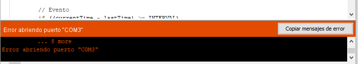
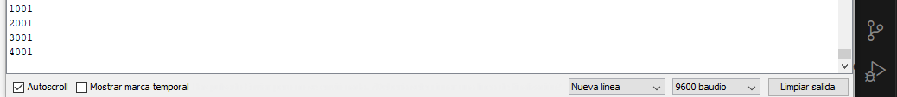
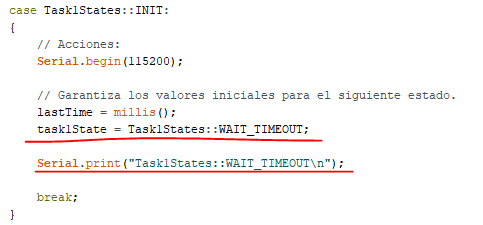

#Exercise 6

After putting the code in the arduino ide, when i uploaded it on the raspberry, it initially said it had problems, and the computer made the "taking out" "putting in" sound as if i has disconected it and then conected it again, I'm guessing that's normal when uploading the code on it.

Then looking at the series monitos i noticed it was a counter, registering a number every second.

The way it works is with states, it has two, INIT and WAIT_TIMEOUT

Initially it also defines lastTime as 0, which will be storing the milliseconds that go by, and INTERVAL as 1000, which states when a number will be printed.

It starts in INNIT, the instruction Serial.begin(115200) appears, it refers to the rate in which the data is transmited, I think, that's what I've gathered from [this](https://www.arduino.cc/reference/es/language/functions/communication/serial/begin/); then it stablishes that lastTime=millis, so lastTime will now be 1, as when the code has just begun it will be one millisecond, and then it changes to the state of WAIT_TIMEOUT

In WAIT_TIMEOUT it's now stablished that a new variable, currentTime=millis, meaning this will be a counter of milliseconds, as this states doesnt immediately change to a different one, currentTime will be able to increase, unlike lastTime; Then there's an if, it states that when currentTime(millisecond counter) minus lastTime(always 1 millisecond) is higher or equal to INTERVAL (1000) then it will set lastTime as the value of currentTime, it will print currentTime's value and jump to the next line in the series monitor

This would mean that when currentTime becomes 1001, it would be printed, and this is what happens:

The code does work as I've analysed!

As for the questions:

1. **How is the program executed?**  I've explained this before in this README :D

2. **Could you see the message "Serial.print("Task1States::WAIT_TIMEOUT\n");"?** Nope. **Why do you think that is?** Because the instruction for printing that is right after the instruction for chnaginf states, meaning it never actually gets executed.

3. **How many times is the code in the case Task1States::INIT executed?** Just once, right at the beginning, it's never called again and there's no way to go back to that state, you can also tell because lasttime starts as 1.
