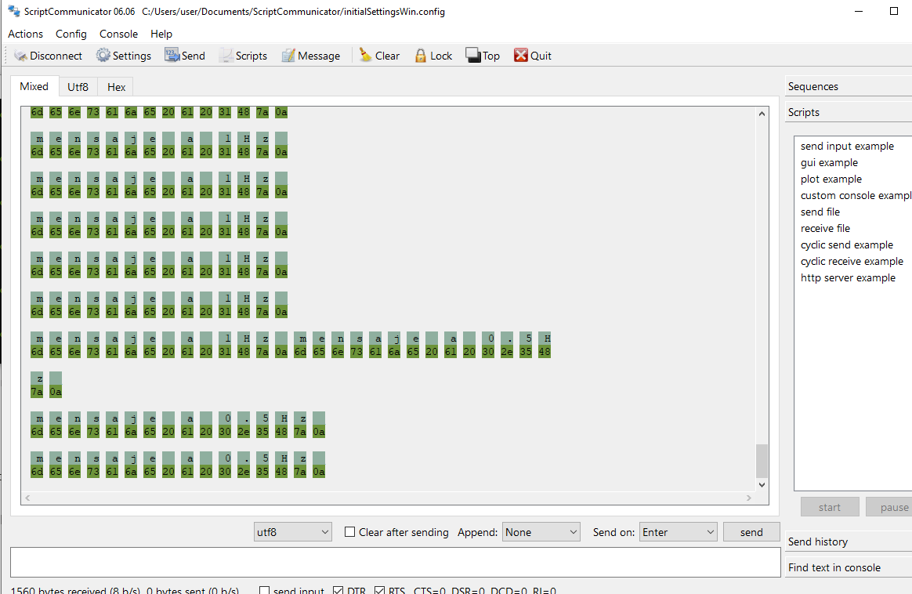

# Exercise 10

In this exercise I just had to download and check ScriptCommunicator, this is how it looks:

The only problem I ran into is that the guide says not to check the send option in settings, but from what I gathered you actually need to check it to be able to use the program.