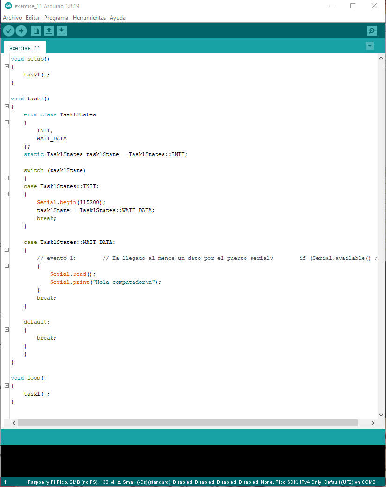
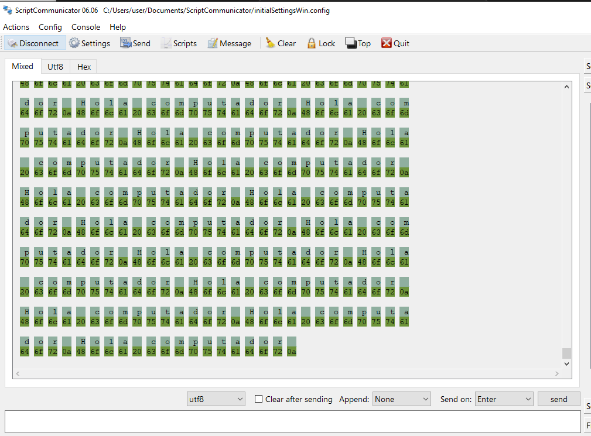
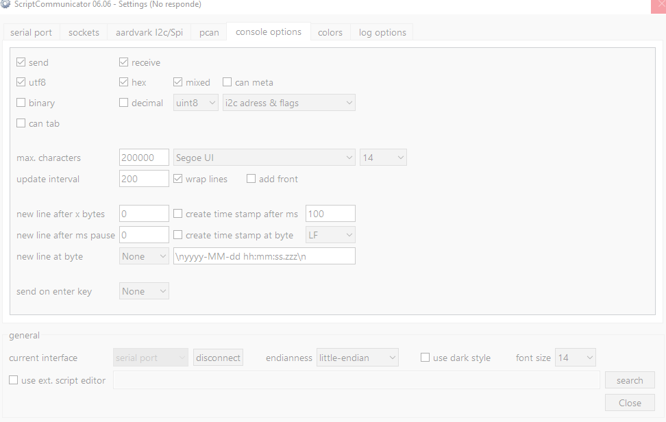
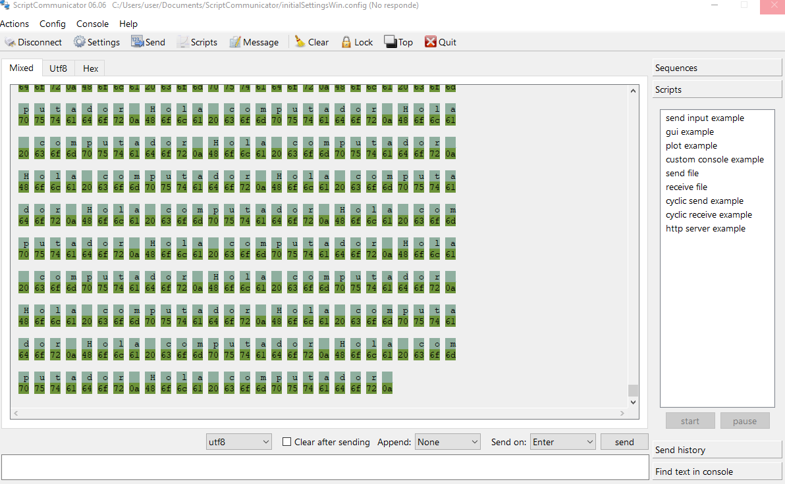
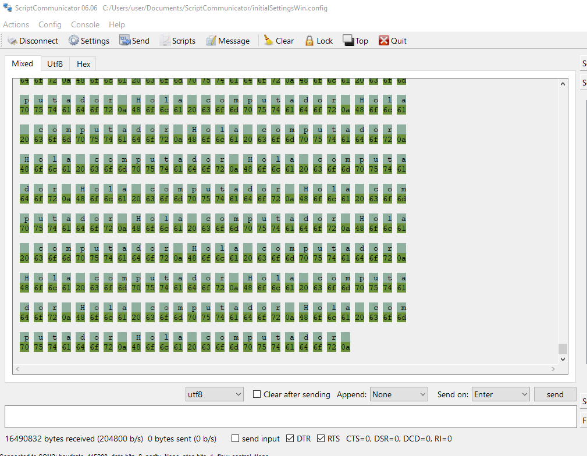

# Exercise 11:

For this exercise i first need to use the aurdino ide to program the raspberry, then I'll use scripcommunicator to see it.



I've only changed the order of setup and task.

This is how it looks on the ScriptCommunicator initially:



My ScriptCommunicator keeps crashing and I'm not sure why.

It doesn't just go away, it's like it's super slow and won't work correctly.





Maybe it was because I had checked the send box, but then I don't understand why it wasn't working before.

As last time tho, I haven't followed all the steps and it's already flooding me with the "Hola computador" message:



And once again, it won't work.

Reading th code, what I'm understanding it's that it thinks i sent something, however I haven't, i don't understand.

## Questions:

1. **Why did you sent the letter with the send button? What event verifies that there's something in the serial port?** This part of the code verifies that:
```
 case Task1States::WAIT_DATA:
    {
        // evento 1:        // Ha llegado al menos un dato por el puerto serial?        if (Serial.available() > 0)
        {
            Serial.read();
            Serial.print("Hola computador\n");
        }
        break;
    }
```
The letter is sent so that condition is satidfied.

2. **Look at [this](https://www.asciitable.com/) table** ok

3. **Analyze the numbers under the letters. after the r, theres a number below** I actually don't see any numbers under letters, I see a lot of numbers bside the,, I'm not sure to what this is referring to, is it the numbers for the letter s?

4. **What is the connection between the numbers and letters?** Those numbers are the different ways a computer understand each letter, since computers can only read numbers.

5. **What is the 0a at the end of the message and what is it for?** Accordint to [this](https://www.freecodecamp.org/news/ascii-table-hex-to-ascii-value-character-code-chart-2/) website is to represent a new line.

6. I don´t understand this question help


I think I know what the problem is

One of the instructions had been copied as part of a comment instead of a whole line, so it was being skipped