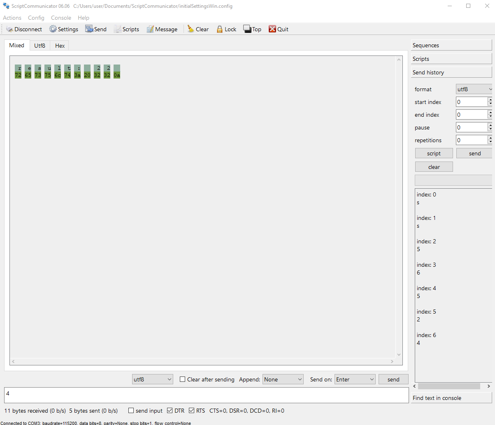

# Exercise 15:

For this exercise I must first analyse this code:

```
static void processData(uint8_t *pData, uint8_t size, uint8_t *res)
{

    uint8_t sum = 0;
    for (int i = 0; i < size; i++)
    {
        sum = sum + (pData[i] - 0x30);
    }
    *res = sum;
}

void task1()
{
    enum class Task1States    {
        INIT,
        WAIT_DATA
    };
    static Task1States task1State = Task1States::INIT;
    static uint8_t rxData[5];
    static uint8_t dataCounter = 0;

    switch (task1State)
    {
    case Task1States::INIT:
    {
        Serial.begin(115200);
        task1State = Task1States::WAIT_DATA;
        break;
    }

    case Task1States::WAIT_DATA:
    {
        // evento 1:        
        if (Serial.available() > 0)
        {
            rxData[dataCounter] = Serial.read();
            dataCounter++;
            if (dataCounter == 5)
            {
                uint8_t result = 0;
                processData(rxData, dataCounter, &result);
                dataCounter = 0;
                Serial.print("result: ");
                Serial.print(result);
                Serial.print('\n');
            }
        }
        break;
    }

    default:
    {
        break;
    }
    }
}


void setup()
{
    task1();
}

void loop()
{
    task1();
}

```

What i initially think it does is add +1 to datacounter everytime something is sent, that something is also stored in one of rxData´s [] thing array, once it reaches 5, it goes to the processData function and that function has another variable, called sum, this one will ultimately be a sum of all the registers in rxData - 0x30, I don't really know what 0x30 means.

then result will be the same as sum.

This was the result the first time I ran it on scriptcommunicator:




## Questions:

1. **Why is it necessary to declare rxData as static? what would happen if it wasn't static?** it's important that it's static because it means it can be used in any part of the class, if it wasnt static then it wouldn't be able to be used in another function.

2. **dataCounter is defined as static and it starts at 0. Does it start as 0 again everytime the loop function is called? Why is it necessary to declare it as static?** A static variable is only initialized once, so it's not 0 everytime the loop function it´s called, but everytime it reaches 5, as it has to start over again. it´s important that it's static precisely because it has to be used again and again in the task1 function.

3. **Finally, why is the 0x30 constant necessary in (pData[i]-0x30)?** Because of the way numbers are assigned in ASCII, they're represented as 0x30,0x31 all the way to 0x39 for the number 0 thru 9, so by sustracting 0x30, what will be represented is the number alone.

