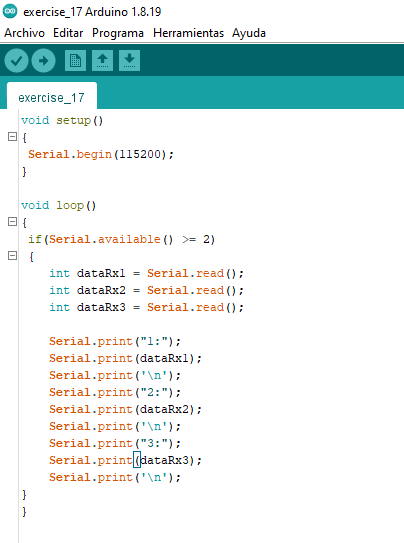
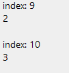
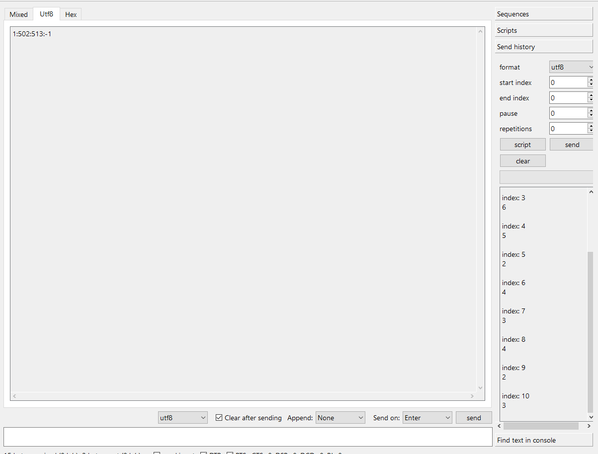

# Exercise 17

This is a way to read 3 pieces of data in the serial port:

```
if(Serial.available() >= 3)
{
    int dataRx1 = Serial.read()
    int dataRx2 = Serial.read()
    int dataRx3 = Serial.read()
}
```

What scenarios could this case have?

```
if(Serial.available() >= 2){
    int dataRx1 = Serial.read()
    int dataRx2 = Serial.read()
    int dataRx3 = Serial.read()
}
```

I think either it will return dataRx3 as -1 or an error will appear

This is my first experiment:








It was as I expected, since the if doesn't let the port see the third character sent, it won't read any data there