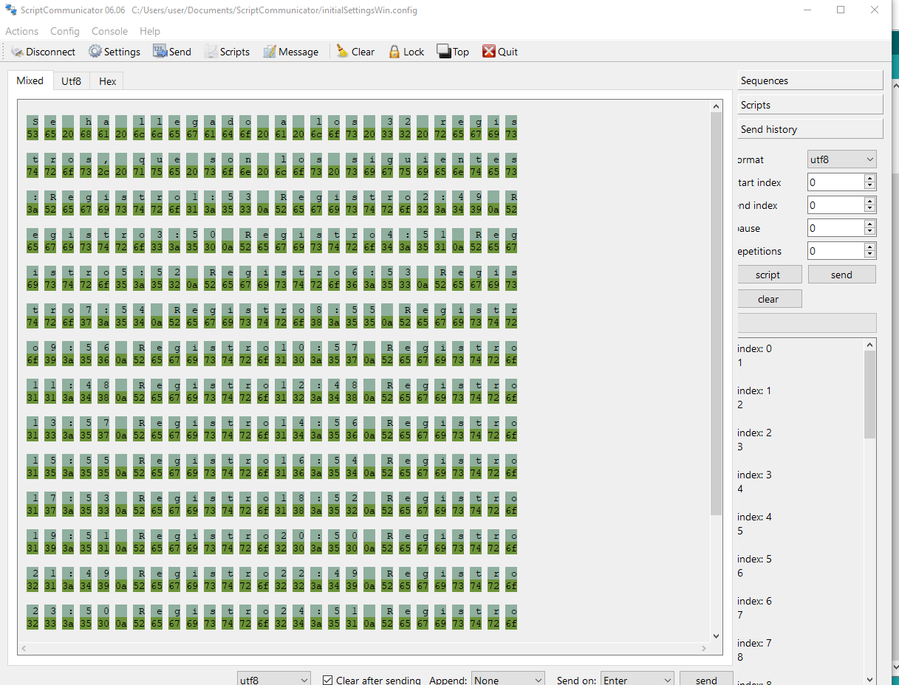
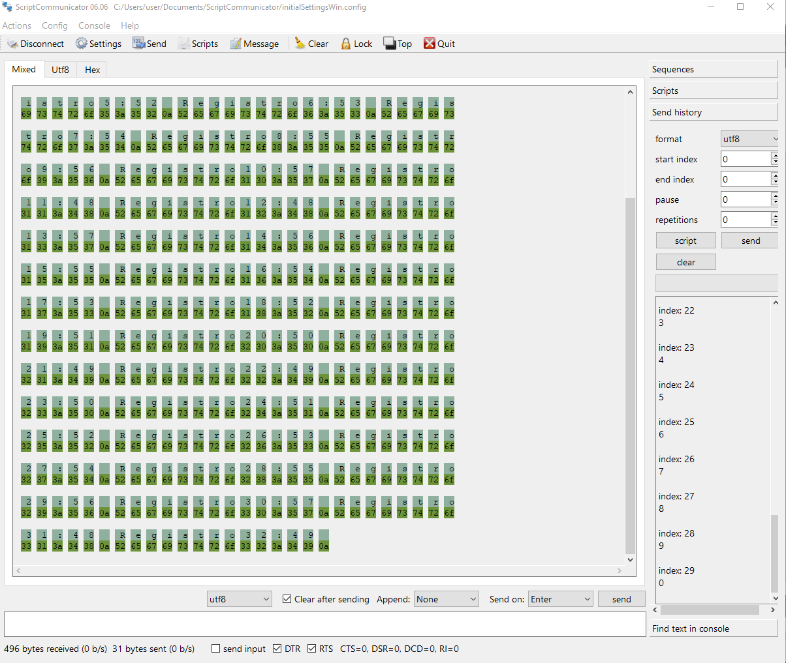

# Exercise 18

I must create an app with one task, it must have its own buffer that can store 32 bytes, that buffer will be an array and that's qhere the data will be stored, it must be inside the task, the data can't be lost between calls for the task, the task must also have a ,echanism that will count the amount of data that's been sent.

Here is my process:

```
void setup() 
{
  task1();
}

void loop() 
{
  task1();
}

void task1()
{
  enum class Task1States
  {
    INIT,
    WAIT_DATA
  };
  static Task1States task1State = Task1States::INIT;
  static uint32_t data[32];
  static uint32_t dataCounter=0;

  switch (task1State)
  {
    case Task1States::INIT:
    {
      Serial.begin(115200);
      task1State=Task1States::WAIT_DATA;
      break;
    }
    case Task1States::WAIT_DATA:
    {
      while (dataCounter<32)
      {
        if (Serial.available()>0)
        {
          data[dataCounter]=Serial.read();
          dataCounter++;          
        }
      }
      if (dataCounter==32)
      {
        Serial.print("Se ha llegado a los 32 registros, que son los siguientes:");
        for (int i=0;i<32;i++)
        {
          Serial.print("Registro");
          Serial.print(i+1);
          Serial.print(":");
          Serial.print(data[i]);
          Serial.print('\n');
        }
      }
    }
  }
}
```

## Parts:

### Does it have one task? 
Yes, it only makes use of task1

### Does it have it's own buffer with a 32byte capacity? 
Yes, this is the buffer:
```
static uint32_t data[32];
```
### Does the task store the data in it's own buffer? 
Yes, as it can be seen in this part of the code:

```
while (dataCounter<32)
      {
        if (Serial.available()>0)
        {
          data[dataCounter]=Serial.read();
          dataCounter++;          
        }
      }
```

### Is the buffer encapsulated inside the task? 
Yes, it's declared and used only in task1

### Is the data lost between calls for the task? 
No, thanks to the buffer and counter both being declared as static, neither of them are initialized again when recalling task1
```
static uint32_t data[32];
static uint32_t dataCounter=0;
```
### How does the task count the ammount of data that's been sent 
I used a while statement and a counter to keep count of the amount of data being sent:
```
while (dataCounter<32)
      {
        if (Serial.available()>0)
        {
          data[dataCounter]=Serial.read();
          dataCounter++;          
        }
      }
```
dataCounter starts as 0, and everytime theres data that can be read, it gets stored in the array and dataCounter goes up by one, it will keep doing that until it reaches 32, then it will follow this if statement:
```
if (dataCounter==32)
      {
        Serial.print("Se ha llegado a los 32 registros, que son los siguientes:");
        for (int i=0;i<32;i++)
        {
          Serial.print("Registro");
          Serial.print(i+1);
          Serial.print(":");
          Serial.print(data[i]);
          Serial.print('\n');
        }
      }
```
This statement prints all the data stored and makes dataCounter go back to 0, restarting everything

## Experiment

This was the result of my first attemp:

I didn't screenshot because I got scared but it worked! The only problem was in this piece of code:

```
    if (dataCounter==32)
      {
        Serial.print("Se ha llegado a los 32 registros, que son los siguientes:");
        for (int i=0;i<32;i++)
        {
          Serial.print("Registro");
          Serial.print(i+1);
          Serial.print(":");
          Serial.print(data[i]);
          Serial.print('\n');
        }
      }
```
Because after this statement dataCounter doesnt change again, it will always be 32, meaning I was calling for the numbers to be printed forever!

I fixed this by adding dataCounter=0; at the end, it also allows me to start again right after printing.

```
    if (dataCounter==32)
      {
        Serial.print("Se ha llegado a los 32 registros, que son los siguientes:");
        for (int i=0;i<32;i++)
        {
          Serial.print("Registro");
          Serial.print(i+1);
          Serial.print(":");
          Serial.print(data[i]);
          Serial.print('\n');
        }
      }
```

Now this is the result for the fixed app:





I don't quite understan why it only shows 30 registers in the send index, but there are 32 in the printing

I also don't understand why it shows those numbers but I'm guessing it has to do with ASCII