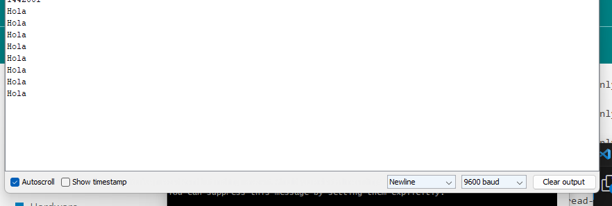

#Exercise 8:

I must make a program that sends a message once after a second, then after two seconds, then three, and then starts over.

For this i will use exercise 6's code and will modify it to make a loop for the 6 seconds it needs and then starts over.

This was my initial try, I changes WAIT_TIMEOUT so that it had if's inside the first if, so it would check first after a second, then after two and then three, this is how it looked:

```
    case Task1States::WAIT_TIMEOUT:
    {
        uint32_t currentTime = millis();

        // Evento
        if ((currentTime - lastTime) >= INTERVAL)
        {
            // Acciones:
            lastTime = currentTime;
            Serial.print("Hola");
            Serial.print('\n');
            INTERVAL = 2000;

            if ((currentTime - lastTime) >= INTERVAL)
            {
            // Acciones:
            lastTime = currentTime;
            Serial.print("Van 2 segundos");
            Serial.print('\n');
                        
                        if ((currentTime - lastTime) >= INTERVAL)
                {
                  // Acciones:
                 lastTime = currentTime;
                 Serial.print("Ya volveremos a empezar :D");
                Serial.print('\n');            
                }

            }

            task1State = Task1States::INIT;
        }
        
        break;
    }
```

It didn't work, the error was this:


What happened was that in the original code INTERVAL is declared as a constant, so it can't change at all, i learned this [here](https://forum.arduino.cc/t/error-compilacion-assignment-of-read-only-variable/522138)

Also I forgot to write INTERVAL = 3000

I will now take out constexpr from the code.

This was the result:



It seems it´s only


