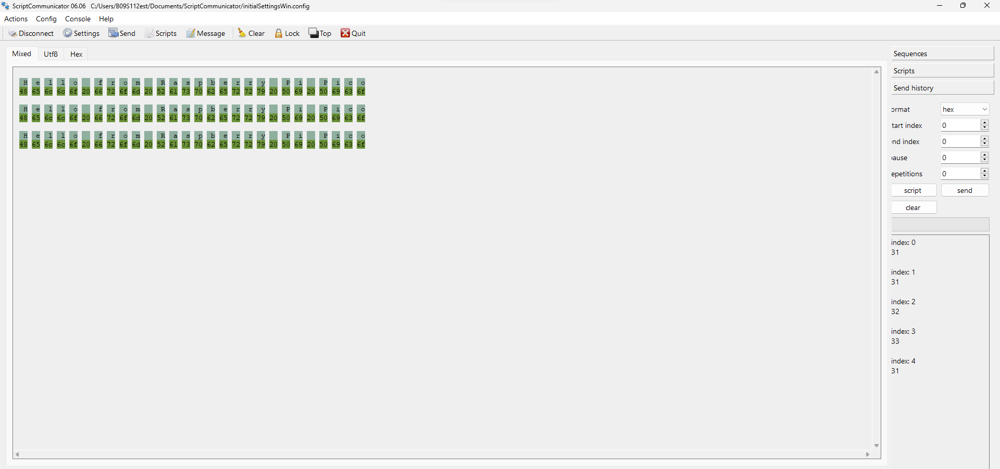

# Exercise 1:

The objecive of this exercise is to stablish communication between the computer and a controller (the raspberry) using the serial port.

I must put this code in the controller and check it out with the scriptcommunicator:

        void setup() {
        Serial.begin(115200);
        }

        void loop() {
        if(Serial.available()){
        if(Serial.read() == '1'){
            Serial.print("Hello from Raspberry Pi Pico");
            }
        }
        }

The result was:

It worked as expected I think.

Explaining step by step, in setup it states the rate at which data is transmitted, pretty standard I think? 

In loop, insted of stating which function should always be running, it outright states the instructions that should always be running, it's constantly checking if there's anything to read, and if that's the case, it will check if it's "1", if it is then it will print the message "Hello from Raspberry Pi Pico", otherwise nothing happens and it will keep checking if there's anything to read, this can be seen in the screenshot, the "33" is the "3" key, and no message was printed.

Now I must create an Unity project, create a C# script and put this code in:

        using UnityEngine;
        using System.IO.Ports;
        public class Serial : MonoBehaviour
        {
        private SerialPort _serialPort =new SerialPort();
        private byte[] buffer =new byte[32];

        void Start()
            {
                _serialPort.PortName = "COM3";
                _serialPort.BaudRate = 115200;
                _serialPort.DtrEnable =true;
                _serialPort.Open();
                Debug.Log("Open Serial Port");
            }

        void Update()
            {

                        if (Input.GetKeyDown(KeyCode.A))
                {
                    byte[] data = {0x31};// or byte[] data = {'1'};            
                                _serialPort.Write(data,0,1);
                    Debug.Log("Send Data");
                }

                        if (Input.GetKeyDown(KeyCode.B))
                {
                                if (_serialPort.BytesToRead >= 16)
                    {
                        _serialPort.Read(buffer, 0, 20);
                        Debug.Log("Receive Data");
                        Debug.Log(System.Text.Encoding.ASCII.GetString(buffer));
                    }
                }

            }
        }

It doesn't do anything yet, but it makes sense to me since the gameobject doesn't have a way to show text yet and the code itself doesn't print anything

## Questions:

1. **Who must start communiaction, the computer or the controller? Why?** I think it's the controller who must start, I would think it's the one to choose where and who to communicate with. 
2. **Explain all the functions used in the unity code** Start() is the code that is executed right at the start, kind of like setup(), Update() is the function called every frame, kind of like loop(), what is put here is what should be seen in screen.
3. **Why are the propieties ***PortName*** and ***BaudRate*** important? What relationship do they have with the controller** I think they refer to the port that the board corresponds to and the data rate, like Serial.begin, theyre important because the first one is the one that will make communication with the board possible, the second one states the data transfer rate.