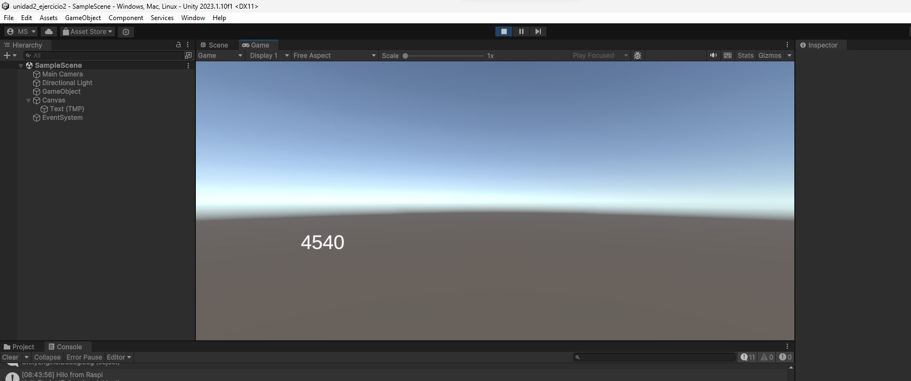

# Exercise 2:

For this exercise I must create another script for an unity project and watch videos to understand the hang of things.

I changed the unity C# code to this:

        using UnityEngine;
        using System.IO.Ports;
        using TMPro;

        public class Serial : MonoBehaviour
        {
            private SerialPort _serialPort =new SerialPort();
            private byte[] buffer =new byte[32];

            public TextMeshProUGUI myText;

            private static int counter = 0;

            void Start()
            {
                _serialPort.PortName = "COM3";
                _serialPort.BaudRate = 115200;
                _serialPort.DtrEnable =true;
                _serialPort.Open();
                Debug.Log("Open Serial Port");
            }

        void Update()
            {
                myText.text = counter.ToString();
                counter++;

                        if (Input.GetKeyDown(KeyCode.A))
                {
                    byte[] data = {0x31};// or byte[] data = {'1'};            
                                _serialPort.Write(data,0,1);
                    int numData = _serialPort.Read(buffer, 0, 20);
                    Debug.Log(System.Text.Encoding.ASCII.GetString(buffer));
                    Debug.Log("Bytes received: " + numData.ToString());
                }
            }
        }

And upload this code to the raspberry:

        void setup()
        {
                Serial.begin(115200);
        }

        void loop()
        {
                if(Serial.available())
                {
                        if(Serial.read() == '1')
                        {
                        delay(3000);
                        Serial.print("Hello from Raspi");
                        }
                }
        }

When I executed the code in unity numbers started appearing on screen:

When I pressed "a" The number would stop for a second and then it kept counting, it doesn't seem to stop

Now I must change the code for this one:

        using UnityEngine;
        using System.IO.Ports;
        using TMPro;

        public class Serial : MonoBehaviour
        {
                private SerialPort _serialPort =new SerialPort();
                private byte[] buffer =new byte[32];

                public TextMeshProUGUI myText;

                private static int counter = 0;

                void Start()
                {
                    _serialPort.PortName = "COM3";
                    _serialPort.BaudRate = 115200;
                _serialPort.DtrEnable =true;
                _serialPort.Open();
                Debug.Log("Open Serial Port");
                }

                void Update()
                {
                myText.text = counter.ToString();
                counter++;

                        if (Input.GetKeyDown(KeyCode.A))
                        {
                    byte[] data = {0x31};// or byte[] data = {'1'};
                    _serialPort.Write(data,0,1);
                }
                        if (_serialPort.BytesToRead > 0)
                    {
                    int numData = _serialPort.Read(buffer, 0, 20);
                    Debug.Log(System.Text.Encoding.ASCII.GetString(buffer));
                    Debug.Log("Bytes received: " + numData.ToString());
                }
                }}

Now it isn't stopping when I press "a", and it waits around 3 seconds before showing the message on debug.

## Questions
1. **How can it be guaranteed that there are 16 bytes to read before the Read operation is executed?**

2. **How does the program know that the message it's completed?**

3. **If the messages sent from the controller are different sizes, how does it know the message it's complete or there are bytes missing?**